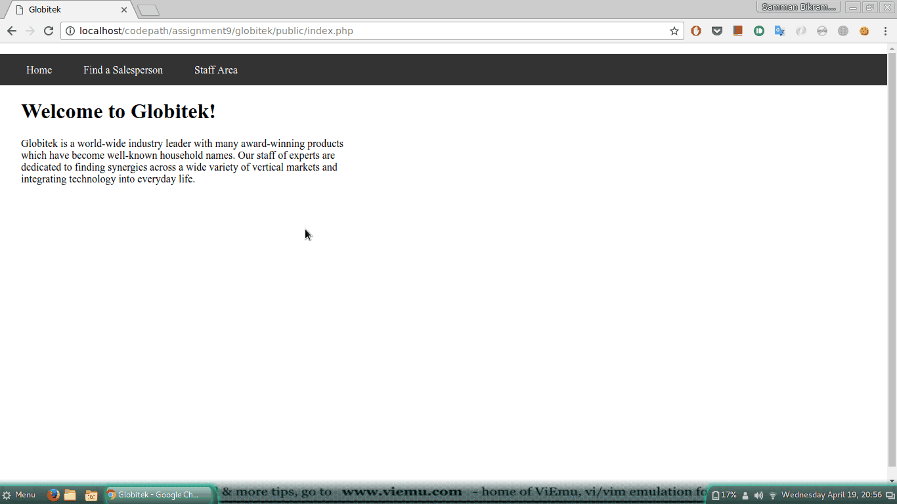

# Project 10 - Fortress Globitek

Time spent: **1** hours spent in total

> Objective: Create an intentionally vulnerable version of the Globitek application with a secret that can be stolen.

### Requirements

- [x] All source code and assets necessary for running app
- [x] `/globitek.sql` containing all required SQL, including the `secrets` table
- [x] GIF Walkthrough of compromise
- [x] Brief writeup about the vulnerabilities introduced below

## Walkthrough

### Vulnerabilities

Describe the vuln(s) here.

> Users can make a sql injection in username while logging it. This way they
> will have access to make db call and get the flag.
